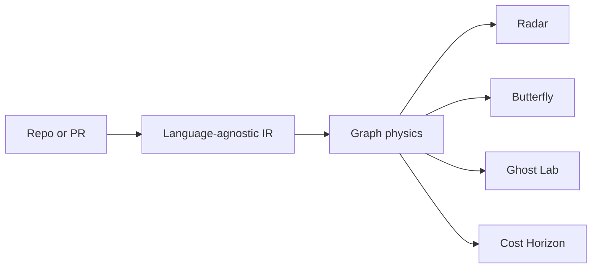
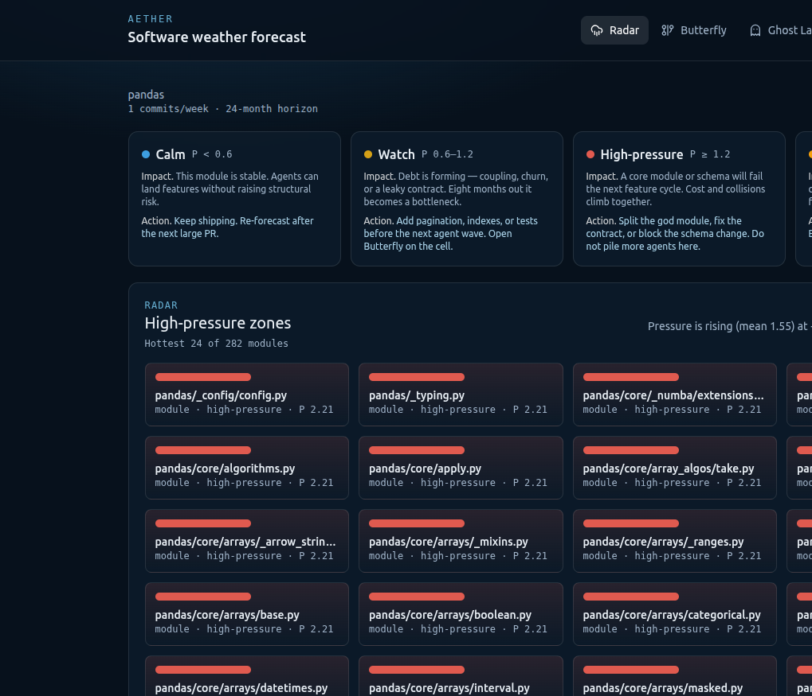
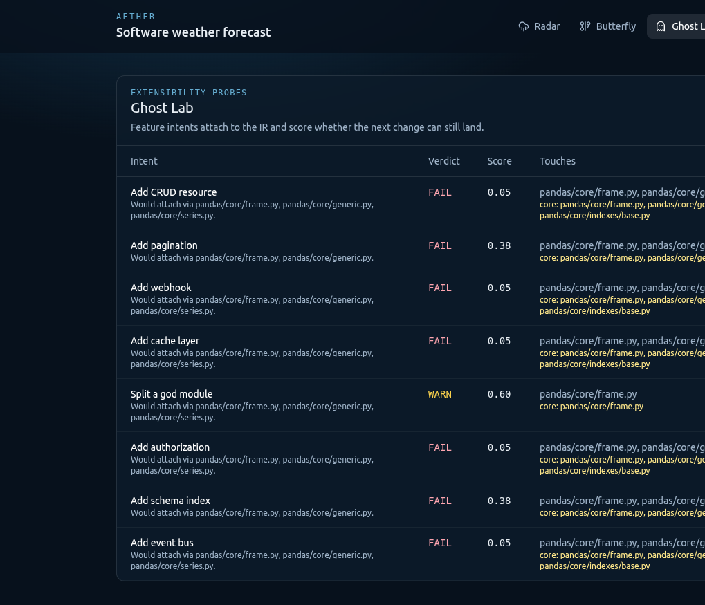
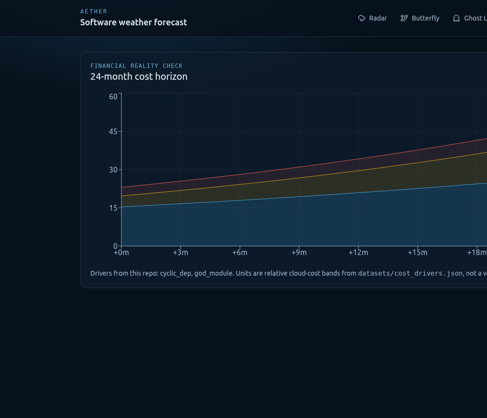
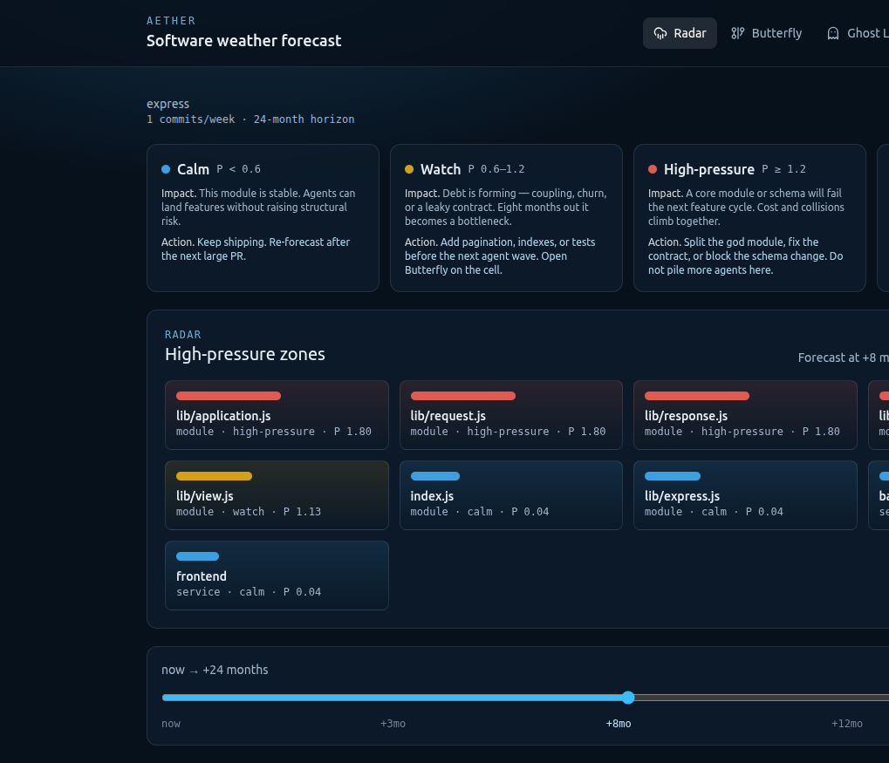
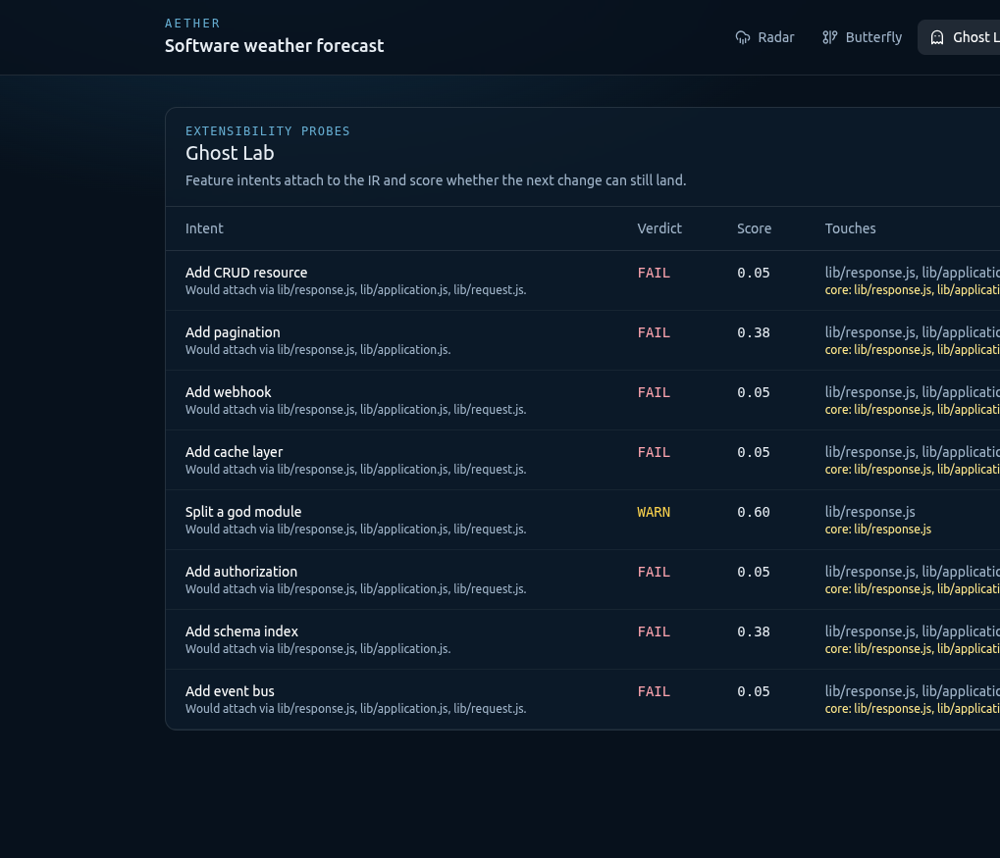
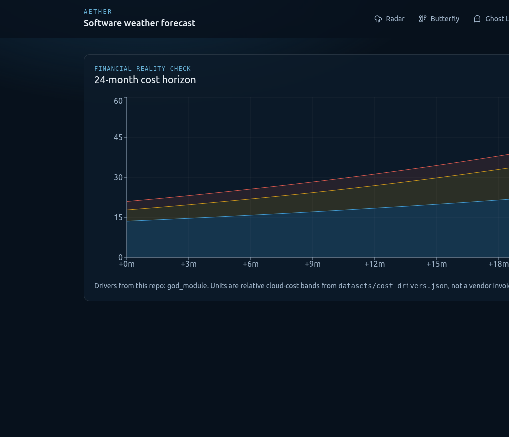

<div align="center">

# Aether
### The software physics engine

**Simulate the future of a codebase before the agents ship it.**

[](LICENSE)
[](engine)
[](web)
[](engine/aether/ir)

[Why](#why-aether) · [Weather](#how-to-read-the-weather) · [Showcase](#showcase) · [Quick start](#quick-start) · [API](#engine-api)

</div>

---

Agents write features at lightspeed. Technical debt now accrues at the same speed.

Aether is not another model that types code. It is a **predictive physics engine for software architecture**. You feed it a repository or a pull request. It compiles a language-agnostic IR, fast-forwards that graph against your team's velocity, and returns a **weather forecast** — high-pressure zones, blast radius, extensibility probes, and a 24-month cost horizon.

Every developer who orchestrates coding agents needs a way to govern what those agents leave behind. Aether is that instrument.

## Why Aether

| Market standard (reactive) | Aether (predictive) |
| --- | --- |
| Agents write the feature today. | Aether prices the **two-year cost of keeping it**. |
| CI asks if the build breaks now. | Ghost Lab asks if the **next** feature can still land. |
| APM pages you when production dies. | Radar flags the structural storm **before deploy**. |



## How to read the weather

Radar is a weather map, not an architecture hairball. Cells are sized by mass and colored by pressure. Scrub `now → +24 months`.

| Status | Pressure | Impact | Action |
| --- | --- | --- | --- |
| **Calm** | P < 0.6 | This module is stable. Agents can land features without raising structural risk. | Keep shipping. Re-forecast after the next large PR. |
| **Watch** | P 0.6–1.2 | Debt is forming — coupling, churn, or a leaky contract. Eight months out it becomes a bottleneck. | Add pagination, indexes, or tests before the next agent wave. Open Butterfly on the cell. |
| **High-pressure** | P ≥ 1.2 | A core module or schema will fail the next feature cycle. Cost and collisions climb together. | Split the god module, fix the contract, or block the schema change. Do not pile more agents here. |
| **Storm** | collision | Two change vectors share a contract — typically schema → API → frontend. | Scrub to +8 months, then open Butterfly and cut that path. |

## Showcase

The same forecast, on the libraries Python and Node teams actually live in.

### pandas — Python

[pandas](https://github.com/pandas-dev/pandas) (BSD-3-Clause). 282 modules on Radar. At +8 months the core is high-pressure (P ≈ 2.21): `pandas/core/frame.py`, `generic.py`, `series.py`, the array stack. Ghost Lab routes the next feature through those same god modules. Cost Horizon prices `cyclic_dep` + `god_module`.

<p align="center">
  
</p>

<p align="center">
  
</p>

<p align="center">
  
</p>

```bash
curl -sS -X POST http://localhost:8000/v1/jobs \
  -H 'Content-Type: application/json' \
  -d '{"url":"https://github.com/pandas-dev/pandas"}'
```

### Express — Node

[Express](https://github.com/expressjs/express) (MIT). The request/response core is already high-pressure: `lib/application.js`, `lib/request.js`, `lib/response.js` at P 1.80. `lib/view.js` is on watch. `index.js` stays calm. Ghost Lab warns on “split a god module” and fails every feature that has to attach through `response.js`.

<p align="center">
  
</p>

<p align="center">
  
</p>

<p align="center">
  
</p>

```bash
curl -sS -X POST http://localhost:8000/v1/jobs \
  -H 'Content-Type: application/json' \
  -d '{"url":"https://github.com/expressjs/express"}'
```

## Four instruments

<table>
  <tr>
    <td width="50%">
      <h3>Time Machine</h3>
      <p>Read the repo’s history, measure pressure, mass, and velocity on the IR, then project a 24-month horizon from your team’s commit velocity. Aether fast-forwards the graph — it does not rewrite the repository.</p>
    </td>
    <td width="50%">
      <h3>Butterfly Effect Matrix</h3>
      <p>Treat a schema change or PR as a perturbation. Watch impact travel across contracts at now, +3, +8, and +24 months. The first-class path is <code>schema → SQL → module → HTTP → frontend</code>.</p>
    </td>
  </tr>
  <tr>
    <td width="50%">
      <h3>Ghost Lab</h3>
      <p>Feature intents — pagination, authz, webhooks, split module, and more — attach to your architecture and score how extensible it actually is before the next agent lands a PR.</p>
    </td>
    <td width="50%">
      <h3>Financial Reality Check</h3>
      <p>Map architectural patterns — unbounded lists, chatty RPC, missing indexes, schema leaks — onto compute, storage, and egress. A 24-month cost horizon tied to decisions you are making today.</p>
    </td>
  </tr>
</table>

## Ingest

Point Aether at a local path or a public `https` / `git` URL on GitHub, GitLab, Bitbucket, or Codeberg.

- Licenses: MIT, Apache-2.0, BSD-2-Clause, BSD-3-Clause
- Languages: Python and TypeScript / JavaScript
- Live progress while history is sampled and the forecast is built
- Public history via documented archives — no scraping

Unresolved cross-service edges stay fog. Aether does not invent certainty.

## Quick start

```bash
# 1. Engine
cd engine
python3 -m venv .venv
source .venv/bin/activate
pip install -e ".[dev]"
uvicorn aether.api:app --reload --port 8000

# 2. Seed the demo history (once)
python ../fixtures/polyglot-debt/seed_git.py

# 3. Dashboard
cd ../web
npm install
npm run dev -- -p 3000
```

If ports `8000` / `3000` are taken:

```bash
uvicorn aether.api:app --reload --port 18100
NEXT_PUBLIC_AETHER_API=http://127.0.0.1:18100 npm run dev -- -p 13100
```

Or: `docker compose up --build`

| Surface | URL |
| --- | --- |
| Radar | http://localhost:3000/ |
| Butterfly | http://localhost:3000/butterfly |
| Ghost Lab | http://localhost:3000/ghosts |
| Cost Horizon | http://localhost:3000/cost |
| Ingest | http://localhost:3000/ingest |
| Engine | http://localhost:8000/health |

## Sixty-second demo

On **Ingest**, point Aether at:

| Target | What you should see |
| --- | --- |
| `https://github.com/pandas-dev/pandas` | Python core under high pressure. Ghost Lab attaches through `frame.py` / `series.py`. |
| `https://github.com/expressjs/express` | Node request/response core at P 1.80. `view.js` on watch. Split-module warn. |
| `fixtures/polyglot-debt` | A planted `orders.status` + `orders.metadata` change. Scrub Radar to **+8 months** — schema colliding with an unbounded `GET /orders`. |

```bash
curl -sS -X POST http://localhost:8000/v1/universes \
  -H 'Content-Type: application/json' \
  -d '{"url":"https://github.com/expressjs/express"}'
```

## Engine API

The dashboard speaks one payload: `ForecastBundle`.

| Method | Path | Purpose |
| --- | --- | --- |
| `POST` | `/v1/universes` | Ingest a path or git URL |
| `POST` | `/v1/jobs` | Start ingest and stream progress |
| `GET` | `/v1/jobs/{id}` | Percent, stage, result |
| `POST` | `/v1/universes/{id}/changesets` | Attach a PR or architectural intent |
| `GET` | `/v1/universes/{id}/forecast?horizon_months=24` | Weather bundle |
| `GET` | `/v1/universes/{id}/graph?t=` | IR slice at a moment in time |
| `GET` | `/health` | Liveness |

## Architecture

```
Aether/
  engine/     Physics engine — IR, ingest, parsers, forecast
  web/        Weather dashboard
  fixtures/   polyglot-debt demo (FastAPI + TypeScript)
  datasets/   Evolution records and cost drivers
```

Parsers compile code into **Aether IR** (`module`, `symbol`, `contract`, `schema`, `service`). Physics is graph math on that IR — mass, gravity, velocity, momentum, pressure, blast radius — not a virtual machine and not a rewrite of your source.

---

<div align="center">

**Govern the agents. Forecast the architecture.**

MIT © Aether

</div>
